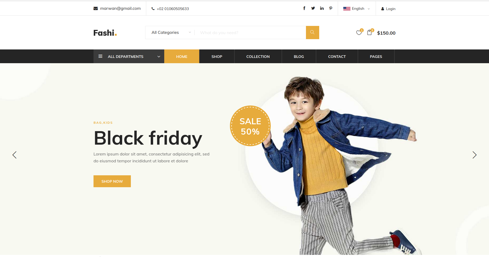
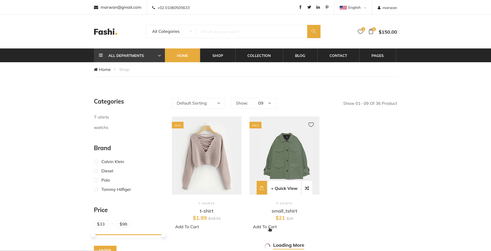
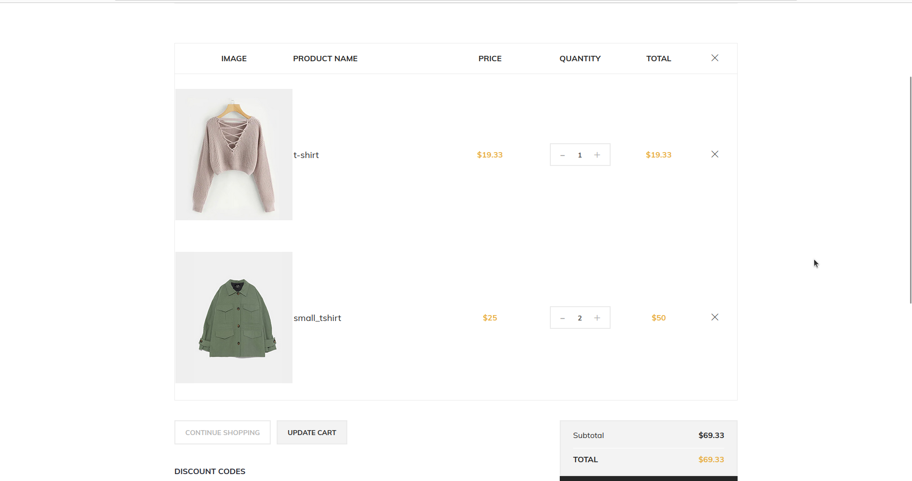
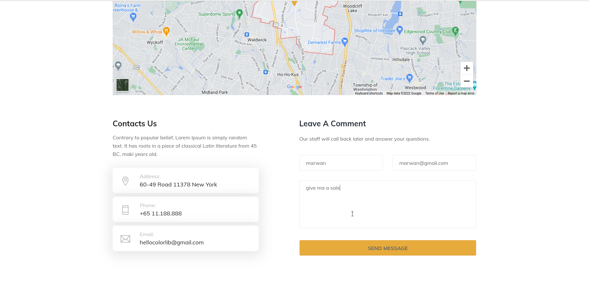
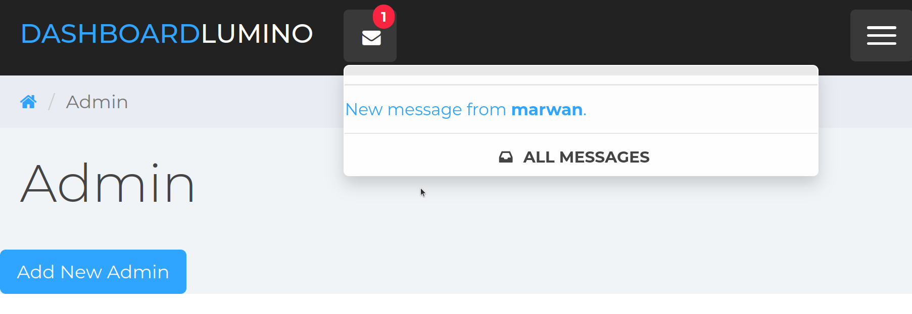
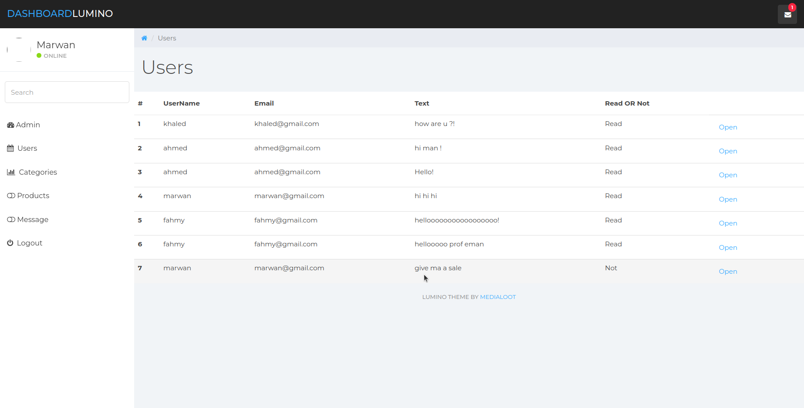
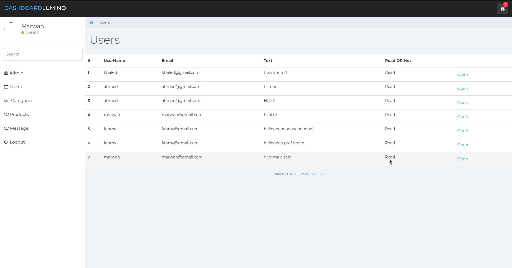

# 

## Project Idea 
The project that simulates e-commerce sites such as (Amazon) but only for clothes and fashion.

## goals 
Facilitating sales operations for the customer and displaying for sale all types of clothing such as men's and children's clothing,
accessories and sports clothing, and the latest fashion and
news about them.

## Services
The project gives you a lot of advantages, which are:
1. complete control over displaying, deleting and updating all products
and the latest fashion news.
2. The user can also communicate with the controller via messages.
3. The user can purchase through the site and add the products he
wants to his shopping cart.

## Usage

1. register and login to be able to shopping and add to your cart.
# 
# 

2. if you need to connect with administrator you can send him a messages
# 
3. the message will be received immediately
goto `localhost/core/dashboard` and login by your account admin to control the app and see the messages and (adding, delete update) products, categories or add new admin
# 

4. if you clicked in the message it will sign as read and the marker will disappear
# 
# 
# 

## Tools used in the project
PHP – XAMPP – BOOTSTRAP - HTML – CSS - MYSQL
